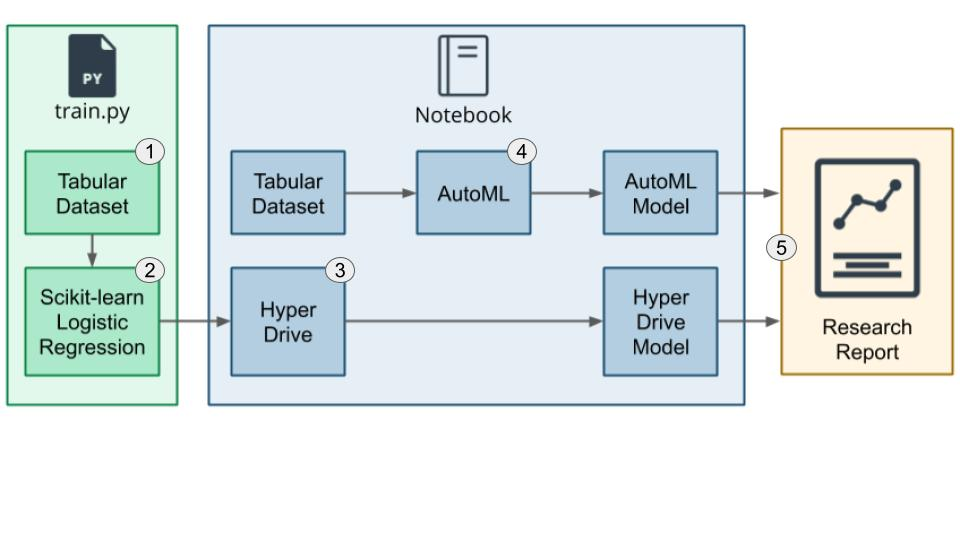

# Optimizing an ML Pipeline in Azure

## Overview
This project is part of the Udacity Azure ML Nanodegree.
In this project, I had the opportunity to build and train an Azure ML pipeline using the Azure Python SDK and a provided Scikit-learn Logistic Regression model. Hyperparameters were optimised using Azure Hyperdrive.  
To compare the results with another method, an Azure AutoML run was built and optimised on the same dataset. 
The following figure displays the main steps that were being taken: 

- Step 1: I started by importing the [bank marketing dataset](dataset/bankmarketing_train.csv) from a specified URL into a Dataframe using the TabularDatasetFactory.
- Step 2: Next, in the [train script](./train.py), I built a logistic regression model using Scikit-learn.
- Step 3: After that, I created a [Jupyter notebook](./udacity-project.ipynb) and used HypeDrive to find the best hyperparameters for the logistic regression model. 
- Step 4: Furthermore, I loaded the same [dataset](dataset/bankmarketing_train.csv) in the Notebook with TabularDatasetFactory and used AutoML to find another optimized model out of the given set of different models (see [Azure AutoML](https://docs.microsoft.com/en-us/azure/machine-learning/concept-automated-ml#many-models)).
- Step 5. Finally, I compared and documented the results of the two methods in this Readme file.  

## Summary
The dataset contains information about possible bank customers based on direkt marketing campaigns (phone calls). The goal of this classification task is to predict whether the customer will subscribe to a term deposit or not. We explore and compare two different approaches: one model using a hpyerparameter-optimized logistic regression model and another model that was built using AutoML. 

The best performing model was found to be a HyperDrive optimized logistic regression model with 95.0% accuracy and the id HD_666d2c70-9aa9-4461-b7cb-d6b43adb83ee_3. The best result using AutoML was a Voting Ensemble algorithms with an accuracy of 91.6% (id AutoML_62082872-6598-496f-936a-4e6dcb1ea86a_24). 

## Scikit-learn Pipeline
**Explain the pipeline architecture, including data, hyperparameter tuning, and classification algorithm.**
The following part is a brief description of the hyperparameter tuning process for the custom-coded model. The necessary steps are: 
###1. Define the parameter search space:

**Parameter sampler**
Tune hyperparameters by exploring the range of values defined for each hyperparameter.
I specified the parameter sampler as such:

    ps = RandomParameterSampling(
        {
            '--C' : choice(0.001,0.01,0.1,1,10,20,50,100,200,500,1000),
            '--max_iter': choice(100,200,300)
        }
    )
I chose discrete values with choice for both parameters, C and max_iter.

*C* is the Regularization while *max_iter* is the maximum number of iterations.

**Parameter Sampling**
Azure Machine Learning supports the following methods:
- Random sampling
- Grid sampling
- Bayesian sampling

I chose RandomParameterSampling because it is the fastest option and supports early termination of low-performance runs. In random sampling, hyperparameter values are randomly selected from the defined search space.

Further options are Grid sampling (Performs a simple grid search over all possible values) or Bayesian sampling (based on the Bayesian optimization algorithm, picks samples based on how previous samples performed, so that new samples improve the primary metric)
Both require enough budget to explore the hyperparameter space. 
###2. Specify a primary metric to optimize
Each training run is evaluated for the primary metric. The early termination policy uses the primary metric to identify low-performance runs.

The following attributes are needed for a primary metric:

- primary_metric_name: The name of the primary metric needs to exactly match the name of the metric logged by the training script
- primary_metric_goal: It can be either PrimaryMetricGoal.MAXIMIZE or PrimaryMetricGoal.MINIMIZE and determines whether the primary metric will be maximized or minimized when evaluating the runs.

In this case, I used the combination to maximize "accuracy". 
###3. Specify early termination policy for low-performing runs
Automatically terminate poorly performing runs with an early termination policy. Early termination improves computational efficiency.Azure Machine Learning supports the following early termination policies:

- Bandit policy
- Median stopping policy
- Truncation selection policy
- No termination policy

I opted for the fastest version, the Bandit policy. Bandit policy is based on slack factor/slack amount and evaluation interval. Bandit terminates runs where the primary metric is not within the specified slack factor/slack amount compared to the best performing run. In other words, Azure ML should check the job every 2 iterations and if the primary metric falls outside the top 50% range, it should terminate the job (as seen in the following code snippet). 
    `policy = BanditPolicy(evaluation_interval=5, slack_factor=0.1)`

###4. Allocate resources
Control your resource budget by specifying the maximum number of training runs.

- max_total_runs: Maximum number of training runs. Must be an integer between 1 and 1000.
- max_duration_minutes: (optional) Maximum duration, in minutes, of the hyperparameter tuning experiment. Runs after this duration are canceled.
- max_concurrent_runs: (optional) Maximum number of runs that can run concurrently. If not specified, all runs launch in parallel. If specified, must be an integer between 1 and 100.
###5. Launch an experiment with the defined configuration
All the configuration files including the entry_point for the .py script are being provided as paramters to the HypeDriveConfig. The hyperdrive run is being submitted. 
###6. Visualize the training runs
Using a Juyper widget.
###7. Select the best configuration for your model
Display the best model using the folliwing snippet: 
    `hd_best_run = hypdrive_run.get_best_run_by_primary_metric()
    best_run_metrics = hd_best_run.get_metrics()
    parameter_values = hd_best_run.get_details()`

## AutoML
Automated machine learning, also referred to as automated ML or AutoML, is the process of automating the time consuming, iterative tasks of machine learning model development. The following describes the model and hyperparameters generated by AutoML. 
In contrast to the manual adjustments I made to the Linear Regression model, the configuration of the AutoML job is pretty straight forward. I defined the following AutoMLConfig: 

`automl_config = AutoMLConfig(
    compute_target = cpu_cluster,
    experiment_timeout_minutes=30,
    task="classification",
    primary_metric="accuracy",
    training_data=dataset,
    label_column_name='y',
    enable_onnx_compatible_models=True,
    n_cross_validations=2)`

In there, the most important parameters are: 
- compute target: the compute target (cluster) for the AutoML job
- task: The type of task to run. Values can be 'classification', 'regression', or 'forecasting' depending on the type of automated ML problem to solve. In this case a classification problem. 
- primary_metric: The metric that Automated Machine Learning will optimize for model selection. Automated Machine Learning collects more metrics than it can optimize. I used accuracy. 
- label_column_name: The name of the label column. If the input data is from a pandas.DataFrame which doesn't have column names, column indices can be used instead, expressed as integers.
-  enable_onnx_compatible_models: Whether to enable or disable enforcing the ONNX-compatible models. The default is False. For more information about Open Neural Network Exchange (ONNX) and Azure Machine Learning, see this [article](https://docs.microsoft.com/en-us/azure/machine-learning/concept-onnx).
- n_cross_validations: How many cross validations to perform when user validation data is not specified. As one cross-validation could result in overfit, in my code I chose 2 folds for cross-validation; thus the metrics are calculated with the average of the 2 validation metrics.

## Pipeline comparison
As stated in the summary, the custom-coded solution based on Scikit-learn resulted in a better solution. However, the effort and invested time was way more in comparison to the AutoML job, since the latter does turn all the necessary knobs for me. I am convinced that if I had the AutoML job more time to run, it would outperform the custom-coded model. 

## Future work
**What are some areas of improvement for future experiments? Why might these improvements help the model?**

## Proof of cluster clean up
**If you did not delete your compute cluster in the code, please complete this section. Otherwise, delete this section.**
**Image of cluster marked for deletion**

## References
The basis for this work can be found under the following link:
- [Official Udacity Repository](https://github.com/udacity/nd00333_AZMLND_Optimizing_a_Pipeline_in_Azure-Starter_Files)

I furthermore used the official Microsoft Azure documentation, namely:
- [What is automated machine learning (AutoML)?](https://docs.microsoft.com/en-us/azure/machine-learning/concept-automated-ml)
- [Hyperparameter tuning a model with Azure Machine Learning](https://docs.microsoft.com/en-us/azure/machine-learning/how-to-tune-hyperparameters)
